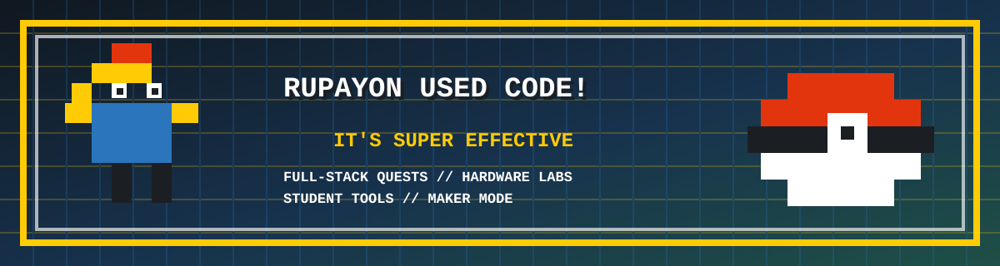
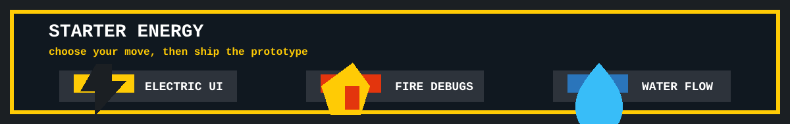
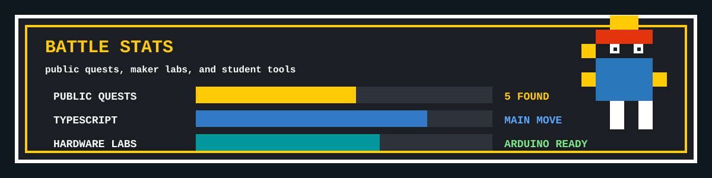
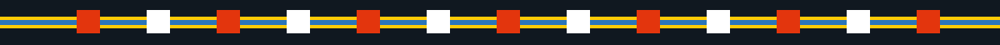

<p align="center">
  
</p>

<h1 align="center">Rupayon Haldar</h1>

<p align="center">
  <b>Code trainer in progress.</b><br />
  Building student tools, hackathon systems, hardware labs, and tiny ideas that evolve into real projects.
</p>

<p align="center">
  <a href="https://github.com/rupayon123?tab=followers">
    
  </a>
  <a href="https://github.com/rupayon123?tab=repositories">
    
  </a>
  
</p>

<p align="center">
  
  
  
  
</p>

<p align="center">
  
</p>

## TRAINER CARD

| SLOT | STATUS |
| --- | --- |
| Class | Full-stack code trainer |
| Current quests | Arduino block coding, hackathon ops, resume tools, student STEM resources |
| Main types | TypeScript, React, Node, Python, hardware |
| Favorite move | Turn messy ideas into working prototypes |
| Power-up goal | Build useful things, ship cleaner, learn faster |

## PARTY LOADOUT

<p>
  
  
  
  
  
  
  
  
</p>

## FEATURED QUESTS

| Project | What it does |
| --- | --- |
| [arduino-blocks-lab](https://github.com/rupayon123/arduino-blocks-lab) | Open-source Arduino block coding lab with Blockly, C++ generation, and board upload flow. |
| [PipHackLup](https://github.com/rupayon123/PipHackLup) | Hackathon operations Discord bot for onboarding, queues, teams, and organizer dashboards. |
| [all-in-one-resume-builder-job-assist-applier](https://github.com/rupayon123/all-in-one-resume-builder-job-assist-applier) | Resume, ATS, job tracking, cover letter, and application helper workspace. |
| [Schematics](https://github.com/rupayon123/Schematics) | Electronics schematics, hardware notes, and project diagrams. |

## BATTLE STATS

<p align="center">
  
</p>

## ROUTE MAP

```text
CURRENT AREA
> ship useful student tools
> level up full-stack systems
> make hardware projects easier to learn
> keep the profile looking like a boss fight
```

## CONTRIBUTION SNAKE

<p align="center">
  
</p>

<p align="center">
  
</p>

<p align="center">
  <b>RUPAYON gained 1 follower.</b><br />
  Next evolution loading...
</p>
