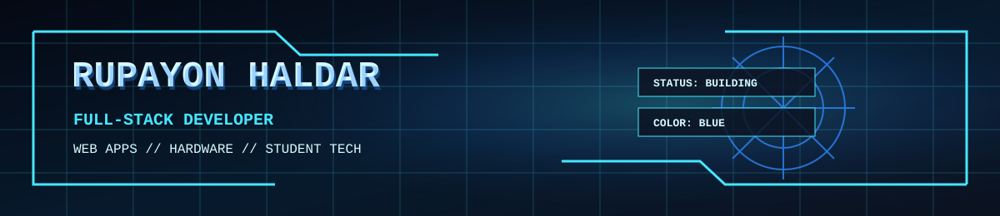
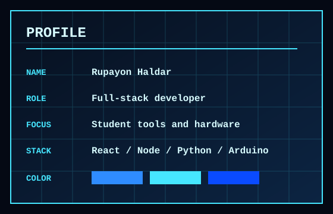

  

# Hi, I'm Rupayon Haldar, a developer from Canada.

## About Me

- I build full-stack web apps, student tools, and hardware learning projects.
- I am currently working with React, TypeScript, Node.js, Python, and Arduino.
- I like making projects that are useful, clean, and easy for people to understand.
- I am interested in web development, automation, hardware, hackathon tooling, and education technology.

## What I'm Working On

- An Arduino block coding lab with Blockly and Arduino C++ generation.
- A hackathon operations bot for onboarding, teams, queues, and organizer dashboards.
- Resume, job tracking, and application tools for students.
- Electronics schematics and hardware notes.

## Technologies

## Featured Projects

| Project | Description |
| --- | --- |
| [arduino-blocks-lab](https://github.com/rupayon123/arduino-blocks-lab) | Open-source Arduino block coding lab with Blockly, Arduino C++ generation, and board upload support. |
| [PipHackLup](https://github.com/rupayon123/PipHackLup) | Hackathon operations Discord bot for onboarding, team management, queues, moderation, and dashboards. |
| [all-in-one-resume-builder-job-assist-applier](https://github.com/rupayon123/all-in-one-resume-builder-job-assist-applier) | Resume, ATS, cover letter, job tracking, and job application workspace. |
| [Schematics](https://github.com/rupayon123/Schematics) | Electronics schematics, hardware notes, and project diagrams. |

## GitHub Activity

<picture>
  <source media="(prefers-color-scheme: dark)" srcset="https://raw.githubusercontent.com/rupayon123/rupayon123/output/github-contribution-grid-snake-dark.svg">
  
</picture>
