

  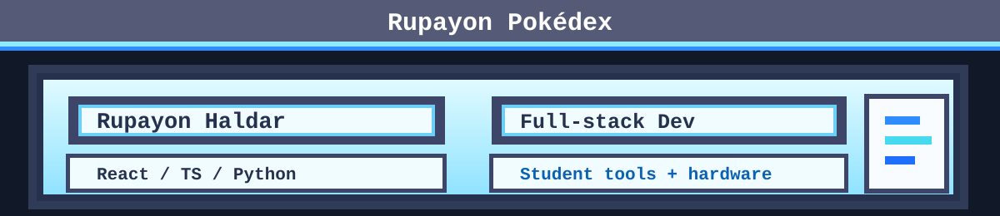

  
  <strong>No.0304</strong>
   
  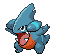
   
   
  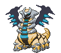
  &nbsp;&nbsp;&nbsp;&nbsp;
  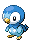
  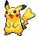
  &nbsp;&nbsp;&nbsp;&nbsp;
  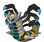
   
  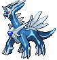
  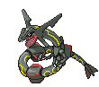
  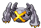
  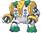
   
  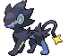
  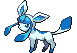
  
  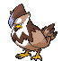
  

# Rupayon Haldar

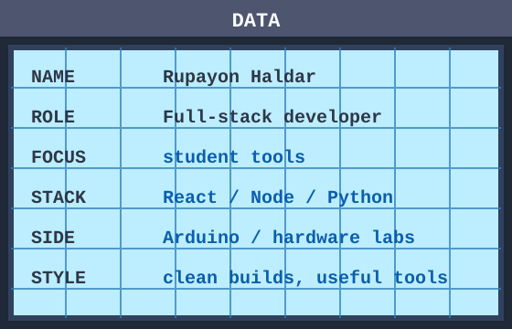

 Full-stack developer building student tools, hardware labs, and hackathon systems.

 I work mostly with React, TypeScript, Node.js, Python, Arduino, and clean UI systems.

 I like projects that feel useful fast: dashboards, automations, learning tools, and practical developer workflows.

 Current focus: better student software, robotics/electronics experiments, and hackathon operations tooling.

## Current Quests

 Arduino block coding lab with Blockly and Arduino C++ generation.

 Hackathon Discord systems for onboarding, teams, queues, moderation, and dashboards.

 Resume, ATS, cover-letter, job tracking, and student application tools.

 Electronics schematics, hardware notes, and experiments worth documenting.

## Featured Repositories

| Repository | Entry |
| --- | --- |
| [PipHackLup](https://github.com/rupayon123/PipHackLup) | Hackathon operations Discord bot for onboarding, team management, queues, moderation, and organizer dashboards. |
| [arduino-blocks-lab](https://github.com/rupayon123/arduino-blocks-lab) | Open-source Arduino block coding lab with Blockly, Arduino C++ generation, and upload support. |
| [gta-free-stem-opportunities](https://github.com/rupayon123/gta-free-stem-opportunities) | Free STEM opportunity finder for GTA families, students, educators, and community hosts. |
| [all-in-one-resume-builder-job-assist-applier](https://github.com/rupayon123/all-in-one-resume-builder-job-assist-applier) | Resume, ATS, cover letter, job tracking, and job application workspace. |
